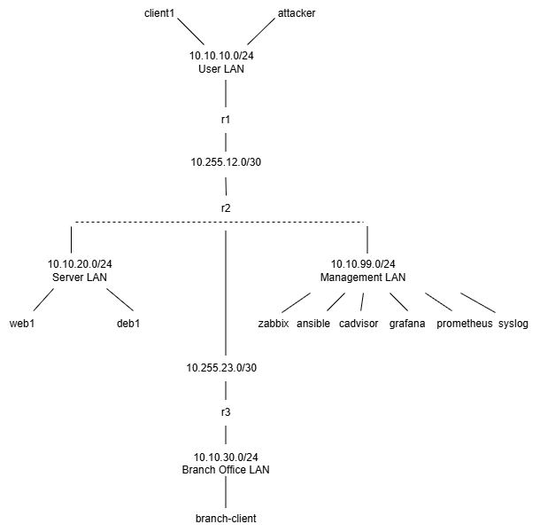

# Verkon dokumentaatio

## Johdanto

Verkonhallinnan opintojakson verkkoympäristö simuloi yritysverkkoa. Ympäristön avulla on tarkoitus harjoitella verkon valvontaan, havainnointiin ja automatisaatioon liittyvien palveluiden käyttöä ja siten simuloida nykyaikaisen verkonhallinnan toimintatapoja.

## Verkkokaavio

## Laiteluettelo

| Laite | Kuvaus |
|:------|:-------|
| r1 | FRRouting-pohjainen ohjelmistoreititin, joka yhdistää R2:n ja käyttäjäverkon |
| r2 | FRRouting-pohjainen ohjelmistoreititin, joka yhdistää R3:n, palvelinverkon ja hallintaverkon |
| r3 | FRRouting-pohjainen ohjelmistoreititin, joka yhdistää R2:n ja sivukonttoriverkon
| client1 | Ubuntu-työasema käyttäjäverkossa |
| attacker | Kali Linux -pohjainen tietoturvatestaukseen käytettävä kone |
| web1 | Web-palvelin palvelinverkossa |
| db1 | Tietokantapalvelin palvelinverkossa |
| branch-client | Sivukonttorin Ubuntu-työasema sivukonttoriverkossa |
| ansible | Palvelinympäristöjen automatisaatiotyökalu |
| prometheus | Monitorointityökalu, joka kerää aikasarjamuotoista mittausdataa palvelimilta ja sovelluksilta |
| grafana | Visualisointialusta mittausdatalle |
| zabbix | Kokonaisvaltainen verkkovalvontaratkaisu |
| syslog | Standardoitu lokien siirtoprotokolla lokien keskitettyyn keräämiseen |
| cadvisor | Konttimetriikoiden seurantaan tarkoitettu työkalu |

## IP-suunnitelma

| Verkko | Tarkoitus | Yhdyskäytävä |
|:-------|:----------|:-------------|
| 10.10.10.0/24 | User LAN | 10.10.10.1 (r1)|
| 10.10.20.0/24 | Server LAN | 10.10.20.1 (r2)|
| 10.10.30.0/24 | Branch Office LAN | 10.10.30.1 (r3)|
| 10.10.99.0/24 | Management LAN | 10.10.99.1 (r2)|
| 10.255.12.0/30 | Point-to-point reititys r1 <-> r2 | Ei yhdyskäytävää |
| 10.255.23.0/30 | Point-to-point reititys r2 <-> r3 | Ei yhdyskäytävää |

###  Verkkojen laitteet
| Verkko | Laitteet | IP-osoitteet |
|:-------|:----------|:-------------|
| 10.10.10.0/24 | client1 | 10.10.10.101 |
|               | attacker | 10.10.10.200 |
| | r1 | 10.10.10.1 |
| 10.10.20.0/24 | web1 | 10.10.20.101|
|               | db1 | 10.10.20.102 |
| | r2 | 10.10.20.1 | 
|10.10.99.0/24 | zabbix | |
| | ansible | |
| | zabbix | |
| | cadvisor | |
| | grafana | |
| | prometheus | |
| | syslog | |
| | r2 | 10.10.99.1 |
| 10.10.30.0/24 | branch-client | 10.10.30.101 |
| | r3 | 10.10.30.1 |
| 10.255.12.0/24 | r1 | 10.255.12.1|
| | r2 | 10.255.12.2 |
| 10.255.23.0/24 | r2 | 10.255.23.1 |
| | r3 | 10.255.23.2|

## Reitityksen analyysi

### Yheyksien testaaminen

Testattiin yhteksien toimivuutta client1 työasemalta web-palvelimelle (web1) ja sivukonttorin työasemalle (branch-client) ping-komennoilla. Tulosteesta selviää, että 4 pakettia lähetettiin ja vastaanotettiin onnistuneesti molempien kohdalla, joten yhteydet toimivat. 

root@client1:/# ping -c 4 10.10.20.101
PING 10.10.20.101 (10.10.20.101) 56(84) bytes of data.
64 bytes from 10.10.20.101: icmp_seq=1 ttl=62 time=0.491 ms
64 bytes from 10.10.20.101: icmp_seq=2 ttl=62 time=0.226 ms
64 bytes from 10.10.20.101: icmp_seq=3 ttl=62 time=0.060 ms
64 bytes from 10.10.20.101: icmp_seq=4 ttl=62 time=0.095 ms

--- 10.10.20.101 ping statistics ---
4 packets transmitted, 4 received, 0% packet loss, time 3037ms
rtt min/avg/max/mdev = 0.060/0.218/0.491/0.169 ms

root@client1:/# ping -c 4 10.10.30.101
PING 10.10.30.101 (10.10.30.101) 56(84) bytes of data.
64 bytes from 10.10.30.101: icmp_seq=1 ttl=61 time=0.552 ms
64 bytes from 10.10.30.101: icmp_seq=2 ttl=61 time=0.082 ms
64 bytes from 10.10.30.101: icmp_seq=3 ttl=61 time=0.147 ms
64 bytes from 10.10.30.101: icmp_seq=4 ttl=61 time=0.158 ms

--- 10.10.30.101 ping statistics ---
4 packets transmitted, 4 received, 0% packet loss, time 3075ms
rtt min/avg/max/mdev = 0.082/0.234/0.552/0.185 ms

### Reitin selvittäminen

Selvitettiin paketin kulkema reitti client1 työasemalta branch-client kohdelaitteelle komennolla traceroute 10.10.30.101. Tulosteesta nähdään, että reitti kulkee neljän hyppäyksen ja reitittimien r1, r2 ja r3 kautta kohdelaitteelle. 

Reitti:

client1 (10.10.10.101) &rarr; r1 (10.10.10.1) &rarr; r2 (10.255.12.2) &rarr;    r3 (10.255.23.2) &rarr; branch-client (10.10.30.101)

root@client1:/# traceroute 10.10.30.101
traceroute to 10.10.30.101 (10.10.30.101), 30 hops max, 60 byte packets
 1  10.10.10.1 (10.10.10.1)  0.781 ms  0.611 ms  0.592 ms
 2  10.255.12.2 (10.255.12.2)  0.549 ms  0.418 ms  0.398 ms
 3  10.255.23.2 (10.255.23.2)  0.381 ms  0.258 ms  0.236 ms
 4  10.10.30.101 (10.10.30.101)  0.218 ms  0.188 ms  0.166 ms
root@client1:/#

### Reititystaulun analysoiminen

Tutkittiin reititystaulua komennolla ip route. Siitä selvisi, että muu liikenne lähetetään 10.10.10.1 eli r1:n kautta.

root@client1:/# ip route
default via 10.10.10.1 dev eth1
10.10.10.0/24 dev eth1 proto kernel scope link src 10.10.10.101
172.20.20.0/24 dev eth0 proto kernel scope link src 172.20.20.2
root@client1:/#

## Yhteenveto

Verkon dokumentaation muodostamisessa eniten aikaa kuluttivat verkkokaavion toteuttaminen, IP-suunnitelman tekeminen ja laitteiden tietojen etsiminen. 

Verkkokaavio ja IP-suunnitelma toteutettiin pääasiassa tutkimalla topologiaa. Topologian tietoja myös yhdistettiin verkkoliitäntöjen tarkempiin tietoihin, joita löydettiin kirjautumalla eri laitteille. Näin selvisi esimerkiksi point-to-point verkkojen tarkat IP-osoitteet. 

Laitteiden käyttötarkoituksen olisi useimmiten pystynyt päättelemään niille annettujen nimien perusteella, mutta haluttiin varmistua käyttötarkoituksesta etsimällä niistä tietoja komennolla grep -Rni "txt" ja lukemalla niihin liittyviä tiedostoja cat-komennolla.
